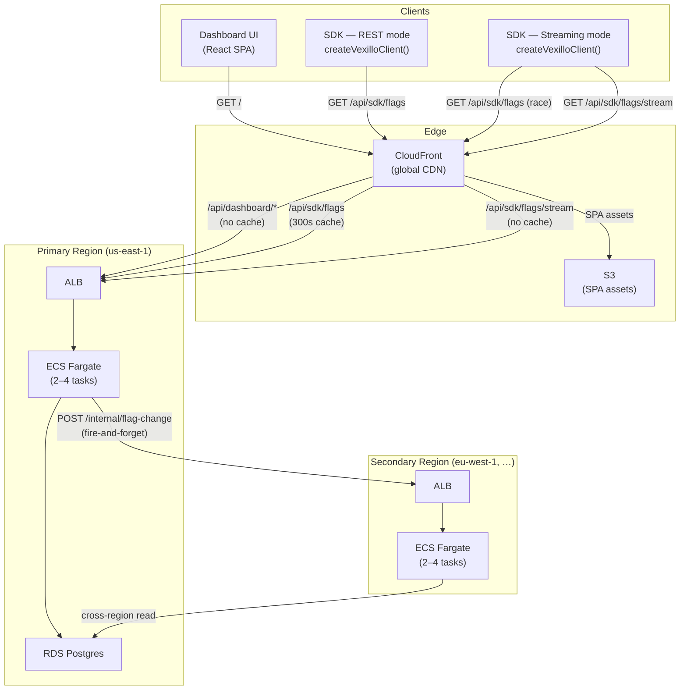
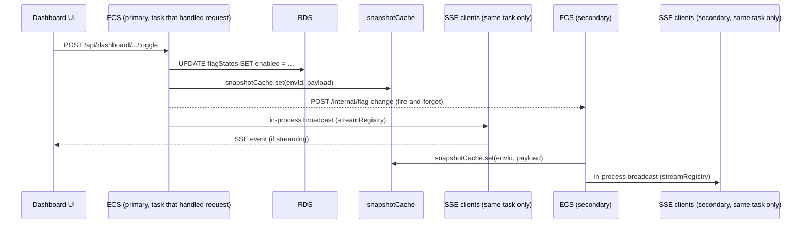
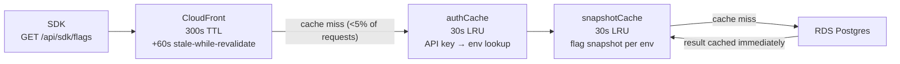
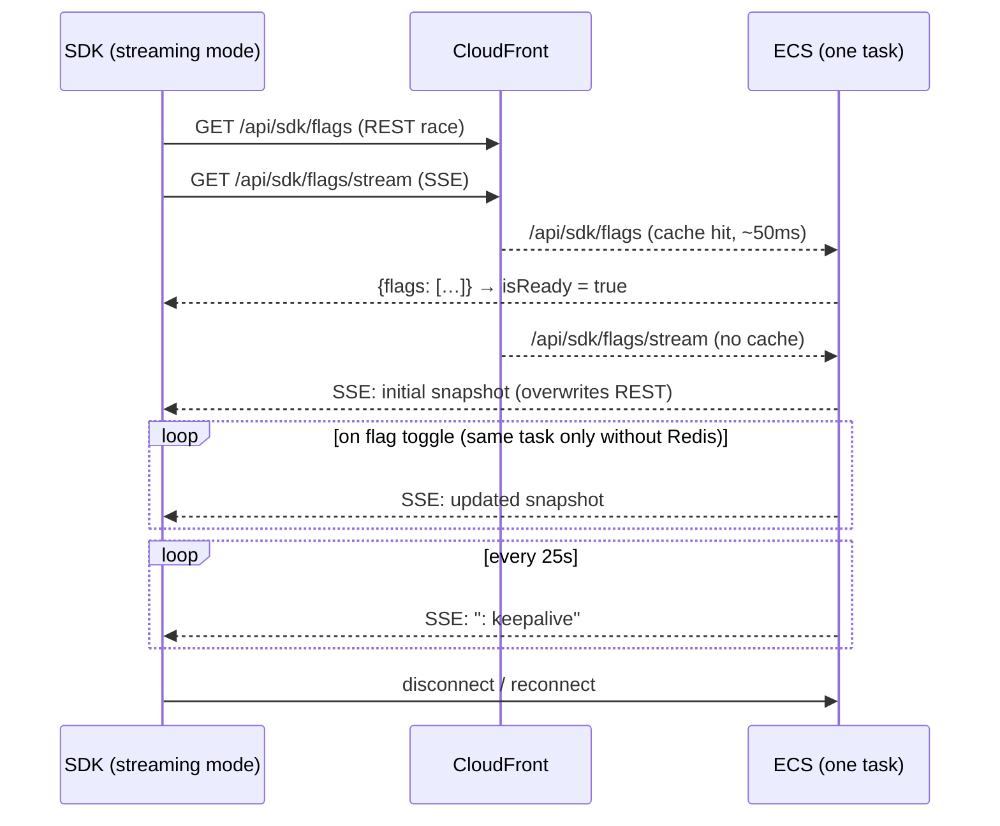

# Architecture

> Scale context: ~1M visits/month, e-commerce storefront.

---

## System Overview

---

## Flag Toggle — Propagation Flow

When an admin toggles a flag in the dashboard, updates reach all connected clients within seconds.

The fan-out to secondary regions is fire-and-forget — it does not block the primary's response. If the secondary misses an event, its `snapshotCache` expires after 30 s and the next request re-queries RDS in us-east-1 as a fallback.

> **Multi-task SSE limitation:** SSE broadcasts are in-process only. A toggle handled by task A is not seen by SSE clients connected to tasks B, C, or D. Those clients receive the update when their `snapshotCache` expires (≤30 s) or when they reconnect. To fan-out across all tasks in a region, set `REDIS_URL` — the app uses Redis pub/sub when the variable is present, but Redis is not provisioned by the CDK stack.

---

## REST Request — Cache Layers

A REST client hitting `/api/sdk/flags` passes through three cache layers before touching the database.

At 1M visits/month, over 95% of requests are served from CloudFront without reaching ECS.

---

## Streaming — Connection Lifecycle

SSE broadcasts are in-process within a single ECS task. If `REDIS_URL` is set, the app uses Redis pub/sub to fan out across all tasks; otherwise only clients on the same task as the toggle receive the real-time event.

The REST race on connect means `isReady` is `true` and components render with real values before the SSE handshake completes. The SSE snapshot then overwrites the cached REST value once it arrives.

---

## Infrastructure Summary

What the CDK stack (`infra/lib/vexillo-stack.ts`) actually provisions:

| Component | Detail |
|---|---|
| CloudFront | Global CDN; caches `/api/sdk/flags` at edge (300 s + 60 s SWR); no cache for dashboard or SSE |
| ECS Fargate | 256 CPU / 512 MB per task; 2 min, 4 max; scales at 65% CPU; 120 s idle timeout (SSE kept alive by 25 s keepalives) |
| RDS Postgres | t4g.micro; primary region only; isolated VPC subnet; 7-day backup retention |
| S3 | SPA assets (dashboard); private bucket, served via CloudFront OAC |
| Secondary regions | No RDS — ECS tasks in the secondary connect to the primary's RDS via `DATABASE_URL` |
| `/internal/flag-change` | ALB-only route (not exposed via CloudFront); protected by `X-Internal-Secret` header |

> **Redis is not provisioned by CDK.** The app supports it via `REDIS_URL` for cross-task SSE fan-out, but it must be provisioned and wired up manually.
